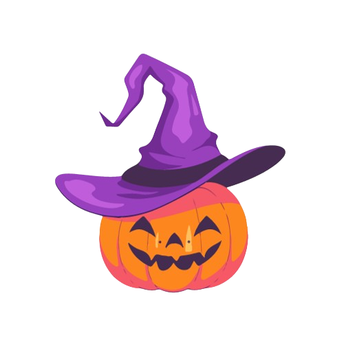

<h1>🎃 Website Halloween</h1>

The main goal of this project is to develop my skills in web languages, with a particular focus on responsiveness. The chosen theme for the website is Halloween, a very popular holiday.  My objective is to create a complete website, from A to Z, before October 31st, to present the history of this holiday and showcase the different traditions and ways of celebrating it.  I plan to include detailed information about the origins of Halloween, associated symbols, as well as ideas for costumes and decorations to inspire visitors.  Additionally, I intend to highlight traditional recipes from this period, fun games, and activities for the whole family. In summary, my aim is to create a comprehensive and entertaining website, providing an immersive and educational experience on the theme of Halloween.

<h2>🎨 The web mock-up</h2>
The fundamental aim of the web mock-up is to visualise the project in its entirety in order to save time later on and simplify tasks.  The plan is to produce this mock-up on the Figma platform, allowing everyone to take a close look and share their comments and suggestions.  This crucial step will ensure a better understanding of the project and guarantee effective collaboration throughout the development process. 
<a href ="https://www.figma.com/file/kLs3OTPtz9ANWPeFHxAuzv/Design-Website-Halloween?type=design&node-id=0%3A1&mode=design&t=qEXUp4AjFCNgEsYs-1">--> La maquette</a>
<h2>🔍To conclude</h2>

  I encountered a few difficulties, particularly during the IT development, but I was able to learn some valuable lessons during the course of this project. During this experience, I had the opportunity to learn how to create a counter using JavaScript, how to manage my time efficiently and how to complete a project satisfactorily.  These new skills will enable me to tackle future projects with greater confidence.

  You can find all my projects by clicking on the link below or via my github profile. 
  <a href ="https://lqmd.notion.site/Mes-Projets-f5994c7b286c484c877819e456414d37?pvs=74)">--> My projects</a>

